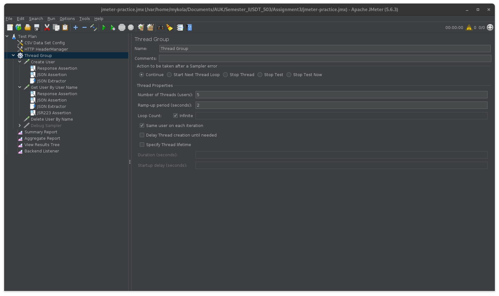

## Influx and Grafana setup

1. Install Docker, run `docker-compose -f docker-compose.yaml up --detach`;
2. Open Grafana at http://localhost:3000, login with credentials specified in ;`docker-compose.yaml`
3. Go to Connections -> Data Sources, search for InfluxDB
  Set:
    * URL - http://influxdb:8086 
    * Database - jmeter 
    * User - admin 
    * Password - my-super-secret-auth-token
4. Go to Dashboards -> New -> Import, Enter 4026 as ID and click Load.

## JMeter performance testing 

### GUI

1. Install JMeter;
2. Start Influx and Grafana (see above);
3. Open `jmeter-practice.jmx`, verify the path to the CSV file;
4. Run tests by clicking "Start" button.

### CLI

1. Install JMeter
2. Verify the path to the CSV file;
3. Run `test.sh` (make sure JMeter is in your PATH).

## Demonstration

#### Grafana dashboard

[demo.webm](https://github.com/user-attachments/assets/96929d74-5b4e-4818-84f5-00571c84db7a)

#### JMeter

